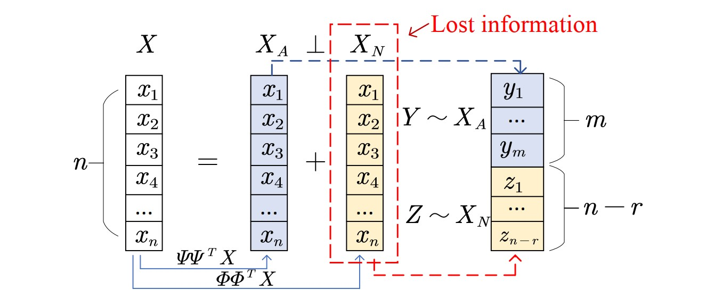
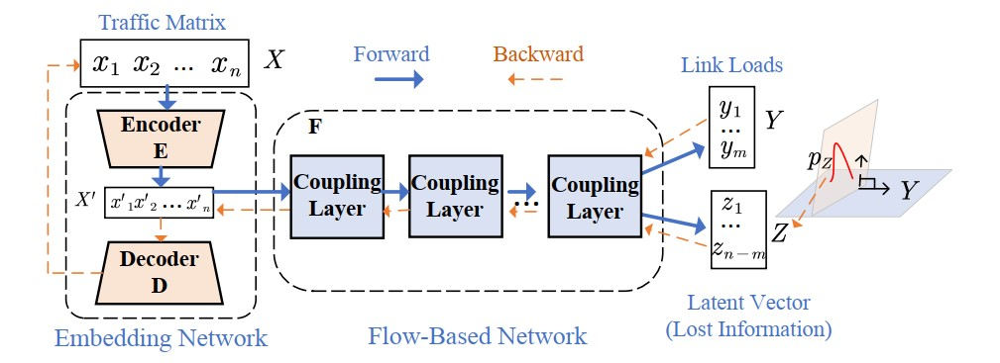
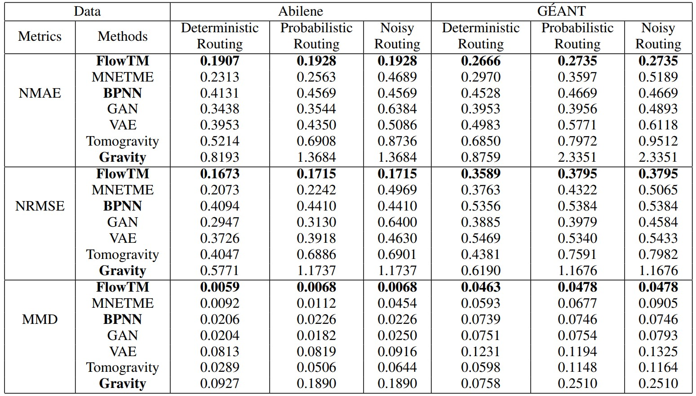

# [INFOCOM 2024] Routing-Oblivious Network Tomography with Flow-Based Generative Model

<div align="center">

<p>


</p>

</div>

<p>
Official implementation of "Routing-Oblivious Network Tomography with Flow-Based Generative Model".
</p>

<p align="center">

<br>
<b>Figure 1.</b> The orthogonal decomposition of traffic matrices.
</p>

In this paper, we for the first time adopt flow-based generative model to TM estimation problem, and approach an invertible correlations between TM and link loads without knowing the specific routing matrix. We demonstrate the lost information in the ill-posed equations can be independently separated from TM. By forcing our model to collaboratively learn the invertible correlations between TM and link loads as well as the distribution of the lost information, the new model can inversely transform the link loads to the true TM unbiasedly.

<p align="center">

<br>
<b>Figure 2.</b> Overall Neural Network Architecture.
</p>


## Requirements
1. Install Python 3.8, and the required dependencies.
2. Required dependencies can be installed by: ```pip install -r requirements.txt```

## Usage
To train and evaluate on a dataset, you can directly run the python scripts:
```train & evaluate
python train.py --dataset <dataset_name> --run-name <run_name> --rm-fn <rm_filename> --batch-size <batch_size> --hd-dims <hd_dims> --n-blocks <n_blocks> --gpu <gpu> --seed <seed> --eval
```
The detailed descriptions about the arguments are as following:
| Parameter name | Description of parameter |
| --- | --- |
| dataset_name | The dataset name (defaults to abilene). This can be set to abilene, or geant|
| run_name | The folder name used to save model and output. This can be set to any word |
| rm_filename | The file name of routing matrix (defaults to abilene_rm.csv). This can be set to abilene_rm.csv for `Abilene` network, or geant_rm.csv for `GÉANT` network (Deterministic or Probabilistic Routing) |
| batch_size | The batch size (defaults to 32) |
| hd_dims | The hidden dimensions (defaults to 100) |
| n_blocks | The hidden dimensions (defaults to 3) |
| gpu | The gpu no. used for training and inference (defaults to 0) |
| seed | The seed for initializing training and inference (defaults to 12345) |
| eval | Whether to perform evaluation after training |

(For descriptions of more arguments, run `python train.py -h`.)

## Main Results
We use two real-world traffic datasets to validate the performance of FlowTM: `Abilene` and `GÉANT`.
FlowTM significantly outperforms six representative baselines in deterministic and noisy routing scenarios regarding estimation accuracy and distribution similarity. Particularly, if the actual routing matrix is absent, our model can improve the performance of the best baseline by 41% ∼ 58% (refer to main paper for full results).
<p align="center">

</p>

## Acknowledgements
The implementation of FlowTM relies on resources from the following codebases and repositories, we thank the original authors for open-sourcing their work.
* https://github.com/VLL-HD/FrEIA
* https://github.com/pkuxmq/Invertible-Image-Rescaling

## Authors

- [Yan Qiao](http://faculty.hfut.edu.cn/qiaoyan/en/index.htm) -  [qiaoyan@hfut.edu.cn](qiaoyan:qiaoyan@hfut.edu.cn)
- [Xinyu Yuan](https://y-debug-sys.github.io/) - [yxy5315@gmail.com](yuanxinyu:yxy5315@gmail.com)

<!-- ## FAQs -->

<!-- ## Citation

If you find this work useful in your research, please kindly cite our paper:

```
``` -->
