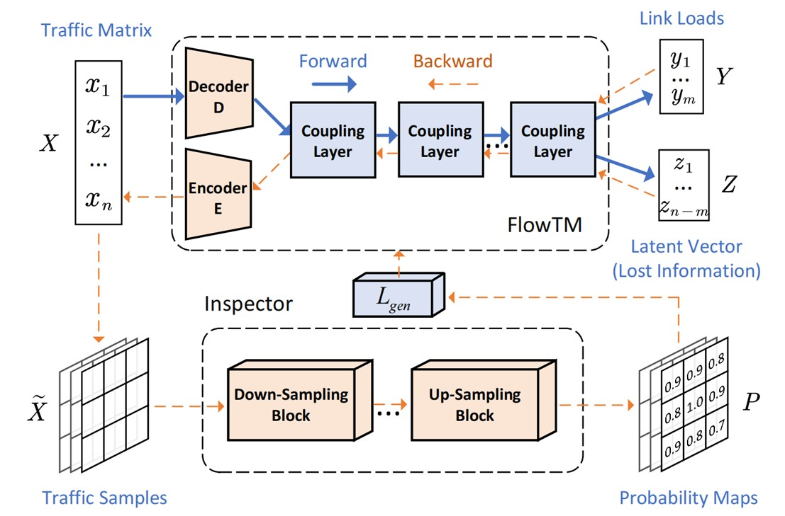
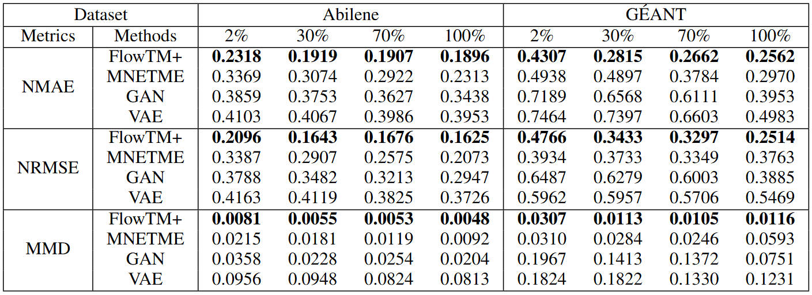

# Routing-Oblivious and Data-Efficient Network Tomography with Flow-based Generative Model

<div align="center">

<p>


</p>

</div>

<p>
Official implementation of "
Routing-Oblivious and Data-Efficient Network Tomography with Flow-based Generative Model".
</p>

<p align="center">

<br>
<b>Figure 1.</b> Overall Neural Network Architecture.
</p>

FlowTM+ is an enhanced flow-based generative framework designed for accurate Traffic Matrix (TM) estimation from partial link load measurements, even when the routing matrix is unknown or unreliable. Built upon our previous work FlowTM, which introduced an invertible mapping between TM and link loads without requiring routing knowledge, FlowTM+ further addresses the challenge of incomplete TM observations by introducing an Inspector module. This module is capable of mining hidden structures from partially observed TM data and link loads, enabling the model to compensate for unobserved information during training. With this enhancement, FlowTM+ achieves competitive estimation performance even with extremely sparse TM training data.


## Requirements
1. Install Python 3.8, and the required dependencies.
2. Required dependencies can be installed by: ```pip install -r requirements.txt```

## Usage
To train and evaluate on a dataset, you can directly run the python scripts:
```train & evaluate
python train.py --dataset <dataset_name> --run-name <run_name> --rm-fn <rm_filename> --batch-size <batch_size> --hd-dims <hd_dims> --n-blocks <n_blocks> --known-rate <known-rate> --use-conv3d --gpu <gpu> --seed <seed>
```
The detailed descriptions about the arguments are as following:
| Parameter name | Description of parameter |
| --- | --- |
| dataset_name | The dataset name (defaults to abilene). This can be set to abilene, or geant|
| run_name | The folder name used to save model and output. This can be set to any word |
| rm_filename | The file name of routing matrix (defaults to abilene_rm.csv). This can be set to abilene_rm.csv for `Abilene` network, or geant_rm.csv for `GÉANT` network (Deterministic or Probabilistic Routing) |
| batch_size | The batch size (defaults to 32) |
| hd_dims | The hidden dimensions (defaults to 100) |
| n_blocks | The hidden dimensions (defaults to 3) |
| gpu | The gpu no. used for training and inference (defaults to 0) |
| known_rate | The known rate of ground truth. |
| use_conv3d | Whether to use 3D Convolutional Inspector. |
| seed | The seed for initializing training and inference (defaults to 12345) |
| eval | Whether to perform evaluation after training |

(For descriptions of more arguments, run `python train.py -h`.)

## Main Results
We use two real-world traffic datasets to validate the performance of FlowTM: `Abilene` and `GÉANT`.
FlowTM+ consistently outperforms all baseline methods across different TM observability levels in terms of both estimation accuracy and distribution similarity. Notably, FlowTM+ achieves the same estimation accuracy as the best baseline trained with 100% TM data by using only 2% of the TM observations on the `Abilene` dataset, and only 30% on the `GÉANT` dataset (refer to main paper for full results).
<p align="center">

</p>

## Acknowledgements
The implementation of FlowTM relies on resources from the following codebases and repositories, we thank the original authors for open-sourcing their work.
* https://github.com/VLL-HD/FrEIA
* https://github.com/pkuxmq/Invertible-Image-Rescaling

## Authors

- [Yan Qiao](http://faculty.hfut.edu.cn/qiaoyan/en/index.htm) -  [qiaoyan@hfut.edu.cn](qiaoyan:qiaoyan@hfut.edu.cn)
- [Minyue Li](...) - [2023170748@mail.hfut.edu.cn](...)
- [Xinyu Yuan](https://y-debug-sys.github.io/) - [yxy5315@gmail.com](yuanxinyu:yxy5315@gmail.com)
